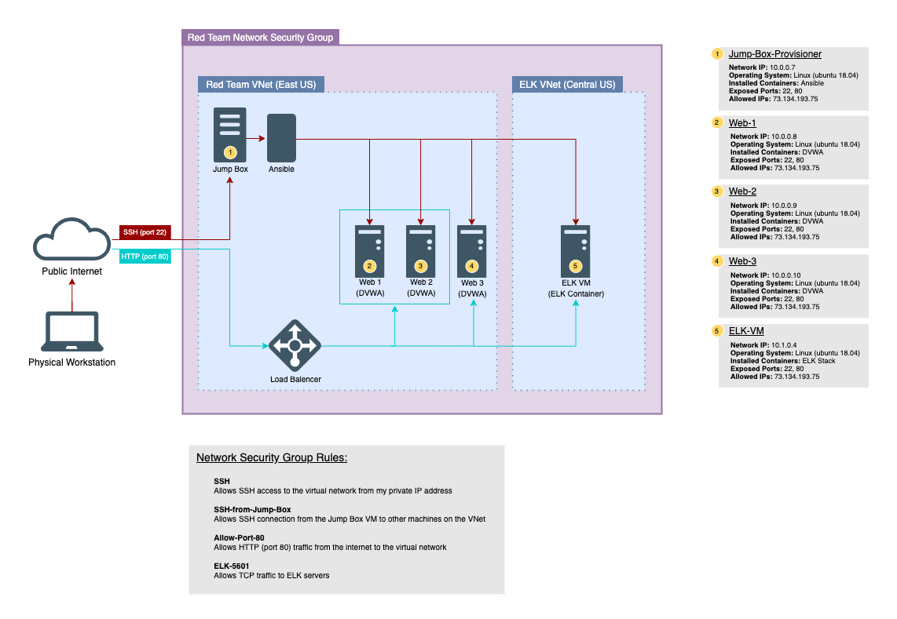
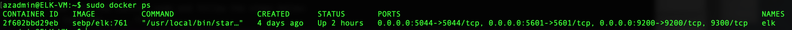

## Automated ELK Stack Deployment

The files in this repository were used to configure the network depicted below.

These files have been tested and used to generate a live ELK deployment on Azure. They can be used to either recreate the entire deployment pictured above. Alternatively, select portions of the playbook file may be used to install only certain pieces of it, such as Filebeat.

  - ELK-Playbook.txt

This document contains the following details:
- Description of the Topologu
- Access Policies
- ELK Configuration
  - Beats in Use
  - Machines Being Monitored
- How to Use the Ansible Build

### Description of the Topology

The main purpose of this network is to expose a load-balanced and monitored instance of DVWA, the D*mn Vulnerable Web Application.

Load balancing ensures that the application will be highly availabe, in addition to restricting access to the network.
- Load balencing ensures availbility by distributing traffic accross a network to ensure redundancy.
- The advantage of a Jump-Box is to have a starting point for accomplishing adminadstrative tasks.

Integrating an ELK server allows users to easily monitor the vulnerable VMs for changes to the logs and system traffic.
- Filebeat watches for changes in the log data
- Metricbeat collects metrics from your opperating system

The configuration details of each machine may be found below.

| Name     | Function  | IP Address | Operating System |
|----------|-----------|------------|------------------|
| Jump Box | Gateway   | 10.0.0.7   | Linux            |
| Web 1    | DVWA      | 10.0.0.8   | Linux            |
| Web 2    | DVWA      | 10.0.0.9   | Linux            |
| Web 3    | DVWA      | 10.0.0.10  | Linux            |
| ELK-VM   | ELK Stack | 10.1.0.4   | Linux            |

### Access Policies

The machines on the internal network are not exposed to the public Internet. 

Only the Jump Box machine can accept connections from the Internet. Access to this machine is only allowed from the following IP addresses:
-  73.134.193.75  

Machines within the network can only be accessed by ssh.
- The Jump Box is the only machine allowed to acces the ELK VM using the private IP address 10.0.0.7

A summary of the access policies in place can be found in the table below.

| Name     | Publicly Accessible | Allowed IP Addresses |
|----------|---------------------|----------------------|
| Jump Box | Yes                 | 73.134.193.75        |
| Web 1    | No                  | 10.0.0.7             |
| Web 2    | No                  | 10.0.0.7             |
| Web 3    | No                  | 10.0.0.7             |
| ELK-VM   | No                  | 10.0.0.7             |

### Elk Configuration

Ansible was used to automate configuration of the ELK machine. No configuration was performed manually, which is advantageous because...
- Ansible is able to deply quickly and it preforms all functions over ssh

The playbook implements the following tasks:
- Creates a new VM on the virtual network
- Downloads and configures the ELK Docker container
- Launches and exposes the container

The following screenshot displays the result of running `docker ps` after successfully configuring the ELK instance.

### Target Machines & Beats
This ELK server is configured to monitor the following machines:
- Web 1-3 ips 

We have installed the following Beats on these machines:
- Filebeat and Metricbeat

These Beats allow us to collect the following information from each machine:
- Filebeat is a lightweight shipper for forwarding and centralizing log data, it monitors the log files or locations that you specify. It collects the log events and forwards them to either elasticsearch or logstash for indexing.
- Metricbeat peridically collects metrics from the OS and the services running on the machine. it takes metrics and statistics and ships them to the output that you specify such as Elasticsearch or Logstash such as the average mesurment of memory usage.

### Using the Playbook
In order to use the playbook, you will need to have an Ansible control node already configured. Assuming you have such a control node provisioned: 

SSH into the control node and follow the steps below:
- Copy the Filebeat-Playbook.yml file to /etc/ansible/roles.
- Update the Filebeat-config.yml file to include the private IP addresses.
- Run the playbook, and navigate to http://<ELK.VM.External.IP>:5601/app/kibana to check that the installation worked as expected.

As a **Bonus**, provide the specific commands the user will need to run to download the playbook, update the files, etc._

- ssh RedAdmin@JumpBoxPrivateIP
- sudo docker container list -a
- sudo docker start [container name]
- sudo docker attach [container name]
- cd /etc/ansible/
- ansible-playbook install-elk.yml (configures and provisions Elk1 VM and starts the elk container) shouldn’t take more than a few minutes for the deployment/activation/implementation of the elk.
- cd /etc/ansible/roles/
- then run the command ‘ansible-playbook filebeat-playbook.yml’ (installs Filebeat)
- for metric beat run ’ansible-playbook metricbeat-playbook.yml (installs Metricbeat)
- In a web browser tab navigate to this kibana web page with the following URL template. http://[YourElkVMPublicIP]:5601/app/Kibana
